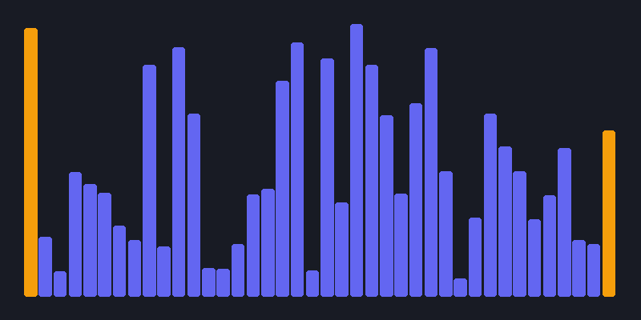

# Algorithm Visualizer



Interactive algorithm visualizer built with Python + Pygame.

Un proyecto interactivo, limpio y fácil de entender, desarrollado en Python con Pygame para visualizar el funcionamiento interno de algoritmos clásicos de ordenación, búsqueda y grafos.
Diseñado con código simple, legible y sin sobreingeniería.

---

## Algoritmos Incluidos

| Categoría | Algoritmo | Complejidad Big-O | Estructura de Datos |
| :--- | :--- | :---: | :--- |
| **Ordenación** | Bubble Sort (Burbuja) | $O(n^2)$ | Lista / Array |
| **Ordenación** | Selection Sort (Selección) | $O(n^2)$ | Lista / Array |
| **Ordenación** | Insertion Sort (Inserción) | $O(n^2)$ | Lista / Array |
| **Ordenación** | Merge Sort (Mezcla) | $O(n \log n)$ | Divide y vencerás |
| **Ordenación** | Quick Sort (Rápido) | $O(n \log n)$ | Partición con pivote |
| **Búsqueda** | Binary Search (Búsqueda Binaria) | $O(\log n)$ | Lista ordenada |
| **Grafos** | BFS (Anchura) | $O(V + E)$ | Cola FIFO (`collections.deque`) |
| **Grafos** | DFS (Profundidad) | $O(V + E)$ | Pila LIFO (`list`) |
| **Grafos** | Dijkstra | $O((V+E) \log V)$ | Cola de Prioridad (`heapq`) |

---

## ¿Como esta hecho?

En lugar de mezclar la lógica de los algoritmos con llamadas a la interfaz gráfica o pausas artificiales con `time.sleep()`, cada algoritmo es una **función generadora** que emite cada paso con `yield`:

```python
def bubble_sort(lista):
    n = len(lista)
    for i in range(n):
        for j in range(0, n - i - 1):
            yield lista, (j, j + 1), f"Comparando {lista[j]} y {lista[j+1]}"
            if lista[j] > lista[j + 1]:
                lista[j], lista[j + 1] = lista[j + 1], lista[j]
                yield lista, (j, j + 1), f"Intercambiando {lista[j]} y {lista[j+1]}"
```

**Ventajas de este enfoque:**
1. **Código 100% testeable:** Se puede probar con `pytest` sin necesidad de abrir la ventana de Pygame.
2. **Pausar y regular velocidad de forma natural:** La interfaz gráfica simplemente llama a `next(generador)` a su propio ritmo.

---

## Controles y atajos de teclado

* **`[ESPACIO]`**: Iniciar / Pausar la animación.
* **`[R]`**: Reiniciar con nuevos datos aleatorios.
* **`[1 al 9]`**: Cambiar de algoritmo:
  * `1`: Bubble Sort
  * `2`: Selection Sort
  * `3`: Insertion Sort
  * `4`: Merge Sort
  * `5`: Quick Sort
  * `6`: Binary Search
  * `7`: BFS
  * `8`: DFS
  * `9`: Dijkstra
* **`[Flecha Arriba / Abajo]`**: Aumentar o reducir la velocidad de la animación.
* **`[Clic Izquierdo]`** *(en modo grafos)*: Dibujar muros/obstáculos en la cuadrícula.
* **`[Clic Derecho]`** *(en modo grafos)*: Borrar muros.
* **`[M]`** *(en modo grafos)*: Generar un laberinto aleatorio de obstáculos.
* **`[L]`** *(en modo grafos)*: Limpiar todos los muros.

---

## Estructura del proyecto

Solo **4 archivos principales**, claros y bien comentados:

```text
├── algorithms.py       # Algoritmos de ordenación y búsqueda con generadores (yield)
├── pathfinding.py      # BFS, DFS y Dijkstra en cuadrícula 2D (deque y heapq)
├── visualizer.py       # Interfaz gráfica y animación con Pygame
├── main.py             # Punto de entrada para ejecutar la aplicación
├── test_algorithms.py  # 14 pruebas unitarias con pytest
└── requirements.txt    # pygame-ce y pytest
```

---

## Instalación y Uso

### 1. Clonar el repositorio
```bash
git clone https://github.com/UnaiIvars/visualizador-algoritmos-python.git
cd visualizador-algoritmos-python
```

### 2. Crear entorno virtual e instalar dependencias
```bash
python -m venv .venv
.\.venv\Scripts\activate
pip install -r requirements.txt
```

### 3. Ejecutar la aplicación
```bash
python main.py
```

### 4. Ejecutar las pruebas unitarias
```bash
pytest -v
```

---
